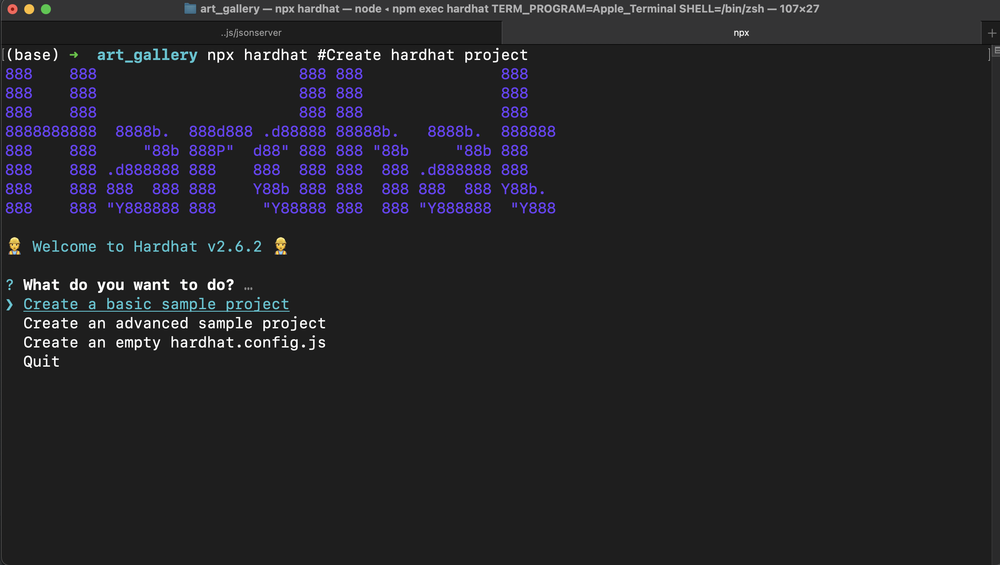
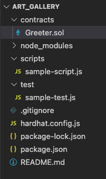
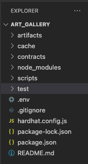
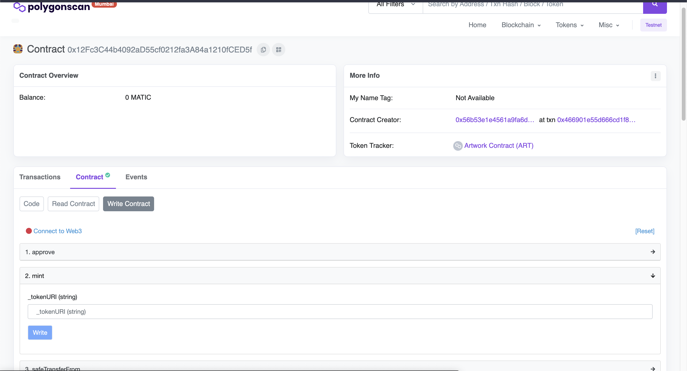
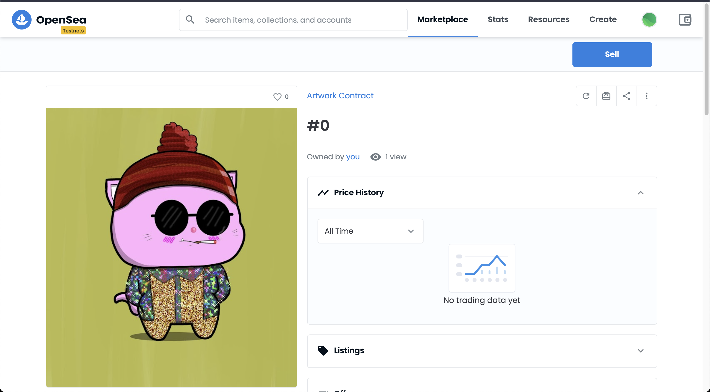

# Introduction

In this tutorial we will learn how to use HardHat which is a popular framework used for smart contract development. It is a JavaScript based framework like Truffle but has certain advantages over Truffle which we will go over in the tutorial. The goal of this tutorial is to build an awesome NFT project where we can convert anything into an NFT. We will also learn how to write, test and deploy smart contracts using the Hardhat framework.

# Prerequisites

This tutorial assumes you have a basic understanding of what smart contracts are & how they are used for building dApp projects. Ideally, you also know about and have used Metamask and are familiar with the concept of public and private keys. Familiarity with Solidity and Javascript along with Node.js will also be very helpful.

# Requirements

Please make sure you have the following software installed:

- [Node.js](https://nodejs.org/en/) v14.17.6 LTS or higher, for installing HardHat and other node packages.
- [MetaMask](https://metamask.io/) for interacting with the blockchain. 
  - Once you have installed MetaMask, add a connection with the [Polygon Mumbai testnet](https://docs.matic.network/docs/develop/metamask/config-polygon-on-metamask).
- Remember to get your account funded with testnet MATIC tokens using the [Polygon faucet](https://faucet.polygon.technology/).

# Creating Polygonscan API key

When we deploy our contract to the blockchain (either mainnet or testnet), it is a good practice to verify the code of our smart contract after deploying it. If our smart contract is **verified**, then the smart contract code will be visible on the block explorer and users will be able to interact with the smart contract directly from the block explorer (such as Polygonscan). Verifying the source code is highly encouraged as it makes our project more transparent, and users are more likely to interact with it.

Using a HardHat plugin, smart contracts can be verified automatically during the deployment process. To do this, we will need a Polygonscan API key. Follow these steps to get your own API key:

1. Open [Polygonscan](https://polygonscan.com/).
2. Click on **SignIn** in the upper right corner of the page.
3. If you already have an account, enter your username and password to login, or else create your new account by visiting [https://polygonscan.com/register](https://polygonscan.com/register).
4. Once you are logged in, go to the API-KEYs section on the left sidebar.
5. Click on the "Add" button, give it a name and click on continue.

You now have an API key which will allow you to access the Polygonscan API features such as contract verification. This key will be same for both mainnet and testnet.

# Creating a HardHat project

To install HardHat, run the command:

```bash
npm install -g hardhat
```

This will install HardHat globally so that later we can make use of the `npx` command to create HardHat projects. 

Now to create our project, we will use the following code

```bash
mkdir art_gallery # I am naming my project folder as art_gallery but any other name works
cd art_gallery    # move into the directory
npx hardhat
```

On typing the last command, something similar to this should appear on your screen:



We can start with a basic sample project so that it is easier to understand the project layout, so let's just press Enter. After this we will be asked to set our project root - Press Enter to keep the default value. Next it will ask if we want a .gitignore file. Press Enter again to keep the default value of "yes" or type n for "no". It will then ask if we want to install the dependencies for our sample project. Press Enter to accept the default of yes. Now HardHat will create a sample project for us and install the dependencies. Once complete, it will look something like this:


**Congrats** 🎊🎊🎊 you have created your first HardHat project!

# Understanding the code

Now let's open our project and take a look at what it contains. I will be using VSCode as my editor of choice but feel free to use any other code editor you are comfortable with.



What we get is a very simple project scaffold. The directory names are quite self explanatory. All our smart contracts, script files and test scripts are going to be kept in their respective directories (folders).

`hardhat.config.js` is the file which contains all the configuration details specific to HardHat.

Before we start writing our smart contract, let's look at the `hardhat.config.js` file which is the heart of our HardHat project. The contents of this file by default are:

```jsx
require("@nomiclabs/hardhat-waffle");

// This is a sample Hardhat task. To learn how to create your own go to
// https://hardhat.org/guides/create-task.html
task("accounts", "Prints the list of accounts", async (taskArgs, hre) => {
  const accounts = await hre.ethers.getSigners();

  for (const account of accounts) {
    console.log(account.address);
  }
});

// You need to export an object to set up your config
// Go to https://hardhat.org/config/ to learn more

/**
 * @type import('hardhat/config').HardhatUserConfig
 */
module.exports = {
  solidity: "0.8.4",
};
```

We start by importing the `@nomiclabs/hardhat-waffle` package which will give us access to the `hre` class. HRE is short for Hardhat Runtime Environment which is an object that contains all the functionality that HardHat exposes. You can think of it as "HardHat *is* hre".

NNext is where we define various tasks which can be run by typing `npx hardhat <TASK_NAME>`

While developing our project we are also doing to write our own custom tasks.

At the end of the file is `module.export` , this is where we are going to list various parameters like compiler version, networks to use, API keys, etc. Please note, here we have defined the solidity version as `0.8.4` .

# Install the OpenZeppelin library

While writing any program, we always prefer using various libraries so that we don't have to write everything from scratch. Since we are going to build an NFT based project, we will follow the standards defined in [EIP-721](https://eips.ethereum.org/EIPS/eip-721). The best way to do this is to import the ERC721 contract present in the OpenZeppelin contracts library and only making the necessary changes for our project. To install this package, open a terminal and run the command:

```text
npm install @openzeppelin/contracts
```

# Starting our smart contract

Let's create a new file named `Artwork.sol` inside the `contracts` directory. This is going to be our first smart contract which will help us in creating NFTs.

```jsx
//SPDX-License-Identifier: Unlicense
pragma solidity 0.8.4; 

contract Artwork {}
```

We start by defining the License of our smart contract. For this tutorial we are keeping it unlicensed. If we don't define the license, it will cause a warning during compile time. The `pragma` keyword is used to define the Solidity version used to compile the code. Make sure you are using the same Solidity version as defined in the `hardhat.config.js` file.

Next we are going to import the ERC721 smart contract from the OpenZeppelin library which we just installed. After the line defining the Solidity version and before defining the contract, import the ERC721 contract:

```jsx
import "@openzeppelin/contracts/token/ERC721/ERC721.sol";
```

## Inheriting ERC721 and constructor initialisation

Make the following modifications to the code:

```jsx
//SPDX-License-Identifier: Unlicense
pragma solidity 0.8.4; 

import "@openzeppelin/contracts/token/ERC721/ERC721.sol";

contract Artwork is ERC721 {

    constructor(
        string memory name,
        string memory symbol
    ) ERC721(name, symbol) {}

}
```

Here we are doing the following things:

- Inheriting the OpenZeppelin ERC721 smart contract into our `Artwork.sol` smart contract using the `is` keyword.
- The constructor is always the first function that is called while deploying a smart contract. Since we are inheriting another smart contract, we have to pass in the values for the constructor of that smart contract while defining our constructor. Here we take a name and symbol as constructor arguments and are passing them to the constructor of ERC721.
- `name` and `symbol` are going to be the name and symbol of our NFT respectively.

## Defining tokenCounter

NFTs are called Non-Fungible Tokens because each one is unique. What makes them unique is the token id assigned to them. We are going to define a global variable called tokenCounter and use it for calculating the token id. It will start with zero and increment by 1 for every new NFT that is created (or "minted"). The value of tokenCounter is set to 0 in the constructor.

```jsx
//SPDX-License-Identifier: Unlicense
pragma solidity 0.8.4; 

import "@openzeppelin/contracts/token/ERC721/ERC721.sol";

contract Artwork is ERC721 {

    uint256 public tokenCounter;

    constructor(
        string memory name,
        string memory symbol
    ) ERC721(name, symbol) {
        tokenCounter = 0;
    }

}
```

## Creating the mint function

Now we are going to define a mint function which can be called by any user in order to mint new NFTs. Each NFT will have certain data associated with it. In our case, we are using images or other collectibles as the basis of the NFT and hence the image should be somehow stored in the smart contract. Since storing data directly on a blockchain has an associated cost, it won't be financially feasible if the entire image and other associated data (metadata) is stored.
So, we will need to host the image separately along with a JSON file containing all the details about the NFT. The image and JSON file can be hosted separately either decentralised (using IPFS) or centrally using traditional methods. The JSON file contains the link to the image as well. Once the JSON file is hosted, the link pointing to that JSON file is stored in the blockchain in the as tokenURI. URI stands for "Universal Resource Identifier". [This](https://opensea-creatures-api.herokuapp.com/api/creature/2) is an example of centrally hosted tokenURI. 

With that in mind, the mint function is how we create each NFT associated with the smart contract:

```jsx
function mint(string memory _tokenURI) public {
    _safeMint(msg.sender, tokenCounter);
    _setTokenURI(tokenCounter, _tokenURI);

    tokenCounter++;
}
```

`_safeMint` is another function present in the OpenZeppelin ERC721 contract which is used to mint new NFTs. It takes two parameters:

- to: The first parameter is the address of an account which will own the NFT after it is minted.
- tokenId: The second parameter is the tokenId of the newly minted NFT.

`msg.sender` is a special keyword which returns the address of the account calling the smart contract. In this case it would return the account currently calling the mint function. Hence the account calling the mint function will be passed as first argument and therefore the minted NFT will be owned by this account. 

The `_setTokenURI()` function is not yet defined so just ignore it for the moment. This function will be used for setting the tokenURI for the minted NFT. This function was present in the ERC721 library but has been discontinued after Solidity version 0.8.0 and so we will need to implement it ourselves.

Once the token is minted and its tokenURI is set, we increment the tokenCounter by 1 so that the next minted token has a new token id.

## Creating the _setTokenURI() function

Our NFT smart contract must store all the valid token id's with their respective tokenURI. For this we can use the `mapping` data type in Solidity. Mappings work similarly to hashmaps in other programming languages like Java. We can define a mapping from a `uint256` number to a `string` which will signify that each token id is mapped to its respective tokenURI. Just after the declaration of the tokenCounter variable, define the mapping:

```jsx
mapping (uint256 => string) private _tokenURIs;
```

Now let's write the _setTokenURI function:

```jsx
function _setTokenURI(uint256 _tokenId, string memory _tokenURI) internal virtual {
    require(
        _exists(_tokenId),
        "ERC721Metadata: URI set of nonexistent token"
    );  // Checks if the tokenId exists
    _tokenURIs[_tokenId] = _tokenURI;
}
```

There are many new terms defined here so let's deal with them one-by-one:

- **internal:** The function is defined with internal keyword. It means this function can be called only by other functions in this smart contract or other smart contracts inheriting this smart contract. This function cannot be called by an external user.
- **virtual:** This keyword means that the function can be overriden by any contract that is inheriting this smart contract.
- **require:** The first thing inside the function body is the `require` keyword. It takes in a conditional statement. If this statement returns true then the rest of the function body is executed. If the conditional statement returns false, then it will generate an error. The second parameter is the generated error message and it is optional.
- **_exists():** This function returns **true** if there is a token minted with the passed tokenId, otherwise it returns **false**.

**In summary**: This function first makes sure that the tokenId for which we are trying to set the tokenURI is already minted. If it is, it will add the tokenURI to the mapping, along with the respective tokenId.

## Creating the tokenURI() function

The last function which we have to create is the `tokenURI()` function. It will be a publicly callable function which takes a tokenId as a parameter and returns its respective tokenURI. This is a standard function which is called by various NFT based platforms like [OpenSea](https://opensea.io/). Platforms like this use the tokenURI returned from this function to display various information about the NFT like its properties and the display image. 

Let's write the tokenURI function:

```jsx
function tokenURI(uint256 _tokenId) public view virtual override returns(string memory) {
    require(
        _exists(_tokenId),
        "ERC721Metadata: URI set of nonexistent token"
    );
    return _tokenURIs[_tokenId];
}
```

- **public:** This function is public which means any outside user can call it.
- **view:** Since this function doesn't change the state of the blockchain, i.e. it doesn't change any value in the smart contract, executing this function will not require any Gas. Since no state change will take place, this function is defined as **view**.
- **override:** We already have a tokenURI() function in the ERC721 contract we have inherited which uses the concept of "baseURI + tokenId" to return the tokenURI. Since we need a different logic, we need to override the inherited function by using this keyword.
- **returns(string memory):** Since this function will return a string value we have to define it when declaring the function. The memory keyword defines where the information is stored.

This function first checks whether the tokenId passed was actually minted. If the token was minted, it returns the tokenURI from the mapping.

## Putting it all together

Putting all the functions together, the final smart contract will look like:

```jsx
//SPDX-License-Identifier: Unlicense
pragma solidity 0.8.4; 

import "@openzeppelin/contracts/token/ERC721/ERC721.sol";

contract Artwork is ERC721 {

    uint256 public tokenCounter;
    mapping (uint256 => string) private _tokenURIs;

    constructor(
        string memory name,
        string memory symbol
    ) ERC721(name, symbol) {
        tokenCounter = 0;
    }

    function mint(string memory _tokenURI) public {
        _safeMint(msg.sender, tokenCounter);
        _setTokenURI(tokenCounter, _tokenURI);

        tokenCounter++;
    }

    function _setTokenURI(uint256 _tokenId, string memory _tokenURI) internal virtual {
        require(
            _exists(_tokenId),
            "ERC721Metadata: URI set of nonexistent token"
        );  // Checks if the tokenId exists
        _tokenURIs[_tokenId] = _tokenURI;
    }

    function tokenURI(uint256 _tokenId) public view virtual override returns(string memory) {
        require(
            _exists(_tokenId),
            "ERC721Metadata: URI set of nonexistent token"
        );
        return _tokenURIs[_tokenId];
    }

}
```

# Compiling the Smart Contract

Now that our smart contract is ready, we must compile it. In order to compile a smart contract with HardHat, run the command:

```text
npx hardhat compile
```

If everything went as expected, you will be getting the message "Compilation finished successfully". If the contract doesn't compile successfully or there are errors, try to read the tutorial again to find out where it went wrong. Some of the possible mistakes are:

- The `SPDX-License-Identifier` is not provided
- There is a mismatch between the Solidity compiler version defined with the **pragma** keyword and the version defined in `hardhat.config.js`.
- There is a version mismatch between the imported smart contract's Solidity version and the version used to write our smart contract. To solve this, double check the version of the OpenZeppelin contracts you are installing with npm. In my case, the npm package is version **4.3.2** and the smart contracts are written with solidity version **0.8.0**.

# Testing the smart contract

At this point, we have written our smart contract and compiled it. However, a successfully compiled smart contract doesn't mean that it is correct! It is very important to write test cases to ensure that it passes all the intended use cases and some edge cases. Testing smart contracts becomes even more important since once a smart contract is deployed to the blockchain it cannot be modified.

We are going to use the `chai` library for writing our tests. This library should have been already installed while creating our project, if not you can use the command `npm install --save-dev chai`.

We are going to test our smart contract for the following:

- **An NFT is minted successfully:** After an account calls the mint function, an NFT is minted for that account and its balance increases.
- **The tokenURI is set successfully:** For two tokens minted with different tokenURIs, both tokens have their own respective tokenURI and the data can be retrieved properly.

## Writing the test cases

In the `test` folder there will be a script called `sample-test.js`. We will delete this file and create a new file called `artwork-test.js` in the same `test` directory. The filename is unimportant but to keep it organized the test file should be somehow related to the contract being tested. In this new file, add the following code:

```jsx
const { expect } = require('chai');
const { ethers } = require("hardhat")

describe("Artwork Smart Contract Tests", function() {

    this.beforeEach(async function() {
        // This is executed before each test
    })

    it("NFT is minted successfully", async function() {

    })

    it("tokenURI is set sucessfully", async function() {

    })

})
```

- **describe:** This keyword is used to give a name to the set of tests we are going to perform.
- **beforeEach:** The function defined inside of `beforeEach` will be executed before every test case. We will be deploying the NFT contract here because the contract must be deployed before each test is run.
- **it:** This is used to write each test case. The `it` function takes in a title for the test and a function which runs the test case.

**NOTE: Unlike with Truffle, HardHat has no need to run `ganache-cli` separately for tests. Hardhat have it's own local testnet which we can use.**

## Deploying contract and writing tests

In order to deploy the smart contract we have to first get a reference to the compiled smart contract using `ethers.getContractFactory()` and then we can use the `deploy()` method to deploy the smart contract and pass in the arguments. We do this in the `beforeEach()` section.

```jsx
let artwork;

this.beforeEach(async function() {
    // This is executed before each test
    // Deploying the smart contract
    const Artwork = await ethers.getContractFactory("Artwork");
    artwork = await Artwork.deploy("Artwork Contract", "ART");
})
```

To check whether the NFT is minted properly, we first get one of the default accounts created by HardHat. Then we call the mint function present in the smart contract with a random tokenURI. We check the balance of the account before and after minting and it should be 0 and 1 respectively. If the contract passes the test, it means that NFTs are minted properly.

```jsx
it("NFT is minted successfully", async function() {
    [account1] = await ethers.getSigners();

    expect(await artwork.balanceOf(account1.address)).to.equal(0);
    
    const tokenURI = "https://opensea-creatures-api.herokuapp.com/api/creature/1"
    const tx = await artwork.connect(account1).mint(tokenURI);

    expect(await artwork.balanceOf(account1.address)).to.equal(1);
})
```

To check whether a tokenURI is set properly, we take two random tokenURIs and set them from different accounts. Then we call the tokenURI() function to get the tokenURI for respective token, then match them with the passed argument to ensure that the tokenURIs are set correctly.

```jsx
it("tokenURI is set sucessfully", async function() {
    [account1, account2] = await ethers.getSigners();

    const tokenURI_1 = "https://opensea-creatures-api.herokuapp.com/api/creature/1"
    const tokenURI_2 = "https://opensea-creatures-api.herokuapp.com/api/creature/2"

    const tx1 = await artwork.connect(account1).mint(tokenURI_1);
    const tx2 = await artwork.connect(account2).mint(tokenURI_2);

    expect(await artwork.tokenURI(0)).to.equal(tokenURI_1);
    expect(await artwork.tokenURI(1)).to.equal(tokenURI_2);

})
```

## Putting it all together

So finally, after putting all the test cases together, the content of `artwork-test.js` file will be:

```jsx
const { expect } = require('chai');
const { ethers } = require("hardhat")

describe("Artwork Smart Contract Tests", function() {

    let artwork;

    this.beforeEach(async function() {
        // This is executed before each test
        // Deploying the smart contract
        const Artwork = await ethers.getContractFactory("Artwork");
        artwork = await Artwork.deploy("Artwork Contract", "ART");
    })

    it("NFT is minted successfully", async function() {
        [account1] = await ethers.getSigners();

        expect(await artwork.balanceOf(account1.address)).to.equal(0);
        
        const tokenURI = "https://opensea-creatures-api.herokuapp.com/api/creature/1"
        const tx = await artwork.connect(account1).mint(tokenURI);

        expect(await artwork.balanceOf(account1.address)).to.equal(1);
    })

    it("tokenURI is set sucessfully", async function() {
        [account1, account2] = await ethers.getSigners();

        const tokenURI_1 = "https://opensea-creatures-api.herokuapp.com/api/creature/1"
        const tokenURI_2 = "https://opensea-creatures-api.herokuapp.com/api/creature/2"

        const tx1 = await artwork.connect(account1).mint(tokenURI_1);
        const tx2 = await artwork.connect(account2).mint(tokenURI_2);

        expect(await artwork.tokenURI(0)).to.equal(tokenURI_1);
        expect(await artwork.tokenURI(1)).to.equal(tokenURI_2);

    })

})
```

You can run the tests with the command:

```text
npx hardhat test
```

This should output:


# Deploy the smart contract

At this point we have learned how to write smart contracts and test them. Now its time we finally move towards deploying our smart contract to the Mumbai testnet so we can show off our newly learned skills to our friends 😎.

Before we move ahead and deploy our smart contract, we will need two additional npm packages:

- **dotenv:** Type `npm install dotenv` . This will be used to manage environment variables, which are used for setting up access to our Polygonscan API key.
- **@nomiclabs/hardhat-etherscan:** Type `npm install @nomiclabs/hardhat-etherscan`. This library is used to verify the smart contract while deploying it to the network. The process of verifying a smart contract on Etherscan and Polygonscan is identical.

## Setting up environment variable



Create a new file named `.env` in the project root directory

Create a new entry in the `.env` file, called `POLYGONSCAN_KEY` and set it to equal the API key created in the beginning of the tutorial. Also add another entry `PRIVATE_KEY` and set it to the private key of the Mumbai testnet account with MATIC in it.

```text
POLYGONSCAN_KEY=Paste the API key here
PRIVATE_KEY=Paste the private key here
```

## Modifying the config file

In order to deploy a verified smart contract to the Mumbai testnet, we have to make certain changes in the `hardhat.config.js` file. First, copy & paste this entire code into the file and then we will go over it step by step to understand what is happening:

```javascript
require("@nomiclabs/hardhat-waffle");
require("@nomiclabs/hardhat-etherscan")
require("dotenv").config();

task("accounts", "Prints the list of accounts", async (taskArgs, hre) => {
  const accounts = await hre.ethers.getSigners();

  for (const account of accounts) {
    console.log(account.address);
  }
});

task("deploy", "Deploy the smart contracts", async(taskArgs, hre) => {

  const Artwork = await hre.ethers.getContractFactory("Artwork");
  const artwork = await Artwork.deploy("Artwork Contract", "ART");

  await artwork.deployed();

  await hre.run("verify:verify", {
    address: artwork.address,
    constructorArguments: [
      "Artwork Contract",
      "ART"
    ]
  })

})

module.exports = {
  solidity: "0.8.4",
  networks: {
    mumbai: {
      url: "https://matic-testnet-archive-rpc.bwarelabs.com",
      accounts: [
        process.env.PRIVATE_KEY,
      ]
    }
  },
  etherscan: {
    apiKey: process.env.POLYGONSCAN_KEY,
  }
};
```

Let's now understand what we are doing here:

- We have imported the `@nomiclabs/hardhat-etherscan` package which is a hardhat plugin that enables us to verify our smart contract after we have deployed it to the network.
- For verifying the smart contract, we will need the Polygonscan API Key we created towards the start of the tutorial. That API key is passed with the `module.export`. Please note that the object name is "etherscan", and the term "apiKey" is used to refer to the key we created.
- We also have created a new task for deploying our smart contract. To create the task, we use the task keyword and pass it a name and description. In this task we have written the code for deploying our smart contract. After deploying the contract, we call the verify:verify task, made available to us by the hardhat-etherscan plugin. We passed the contract address along with the parameters passed to the constructor while deploying the contract.
- Finally since we are going to deploy our contract to Mumbai testnet, we created a new entry in the network section and added the RPC url to Mumbai testnet along with the private key of the account which will be used to deploy the smart contract.

## Deploying the smart contract

We are now ready to deploy our contract to testnet. Run the following command:

```text
npx hardhat deploy --network mumbai
```

Now we have to wait for a few minutes as the contract is deployed and verified. 🤞🤞🤞

If everything is correct you should get an output similar to this:


You can now view your contract at the link provided in the output. You can check out my example of the deployed contract [here](https://mumbai.polygonscan.com/address/0x12Fc3C44b4092aD55cf0212fa3A84a1210fCED5f).

## Potential errors while deploying

**Insufficient Funds**

If the private key you passed belongs to an account which doesn't have sufficient MATIC tokens to deploy the contract, you will get this error:

```text
Error: insufficient funds for intrinsic transaction cost (error={"name":"ProviderError","code":-32000,"_isProviderError":true}, method="sendTransaction", transaction=undefined, code=INSUFFICIENT_FUNDS, version=providers/5.4.5)
...
reason: 'insufficient funds for intrinsic transaction cost',
code: 'INSUFFICIENT_FUNDS',
error: ProviderError: insufficient funds for gas * price + value
...
method: 'sendTransaction',
transaction: undefined
```

In this case, please remember to fund your deployment account using the [faucet](https://faucet.polygon.technology/).

**Invalid API Key**

If the Polygonscan API Key you entered is missing or is not valid, you are going to get the following error message:

```text
Nothing to compile
Compiling 1 file with 0.8.4
Error in plugin @nomiclabs/hardhat-etherscan: Invalid API Key

For more info run Hardhat with --show-stack-traces
```

In this case please make sure you are entering the correct API key.

# Interacting with the smart contract

If we view our smart contract on Polygonscan, you can see that our contract is verified. This is indicated by a green checkmark in the Contracts tab. In the Contracts tab, click on `Write Contract`. Now click on "Connect to Web3" and connect your Metamask account.



Now select the `mint` action and put in your tokenURI. I am using [https://gambakitties-metadata.herokuapp.com/metadata/1](https://gambakitties-metadata.herokuapp.com/metadata/1) as my tokenURI. If you want, you can create your own tokenURI by hosting it using IPFS. Once you enter your tokenURI, click on the "Write" button. This will show a Metamask popup. Confirm the transaction and wait for it to be confirmed.


Congratulations🥳🥳🥳, Your NFT is successfully minted. You can visit the [Opensea Testnet](https://testnets.opensea.io/) page and in the "My Profile" section you can now view your NFT. Checkout the example [here](https://testnets.opensea.io/assets/mumbai/0x12fc3c44b4092ad55cf0212fa3a84a1210fced5f/0).



# Conclusion

In this tutorial, we learned some of the basics of HardHat. We wrote a smart contract that can be used to create NFTs, wrote tests for our smart contract and finally deployed it to the Mumbai testnet. We also verified our contract using a HardHat plugin and a Polygonscan API key. Using a similar procedure, we can build any number of DeFi projects and deploy to any EVM compatible network (Ethereum, Polygon, Binance Smart Chain, Avalanche, etc.). 

# Next Steps

Why stop here? Looking ahead, you can also learn how to build an NFT Marketplace contract where various NFTs can be listed, bought and sold. You can also dig deeper into other aspects of NFTs and learn new things 😎!

# About The Author

Hi, my name is Bhaskar Dutta and I am a blockchain Developer, Researcher and Freelancer. I am always looking forward to learning new things and I like to discuss Sitcoms. To know me better, you can check out my [Github](https://github.com/BhaskarDutta2209) profile.

# References

I found the following very helpful while learning:

- [Hardhat Official Documentation](https://hardhat.org/)
- [Matic Official Documentation](https://docs.matic.network/docs/develop/getting-started)
- [OpenZeppelin Forum Page](https://forum.openzeppelin.com/t/function-settokenuri-in-erc721-is-gone-with-pragma-0-8-0/5978/3) about the setTokenURI change in Solidity 0.8.0.
