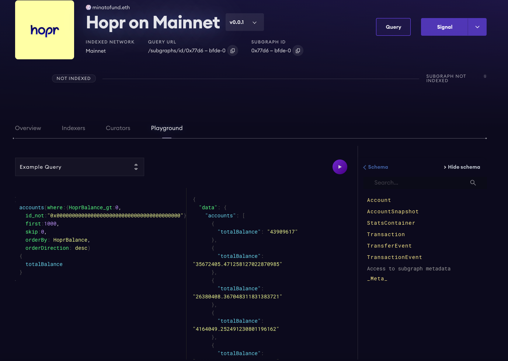
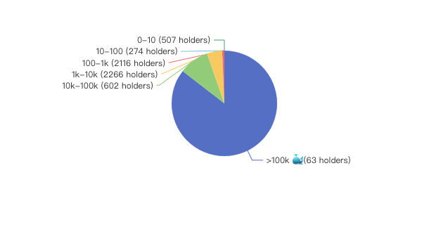

# Introduction

In this tutorial you will learn how to create a simple React app by leveraging some existing Graph Protocol subgraphs. It includes configuring GraphQL queries and explains how to perform simple data visualization using a pie chart.

# Prerequisites

In order to complete this tutorial, you will need to have some basic knowledge about NodeJS, ECharts library and GraphQL query. Also, get familiar with existing subgraph schema and the Graph Explorer can be super helpful.  

In this tutorial, you will interact with the `Hopr on Mainnet` subgraph. You can use this [playground](https://thegraph.com/explorer/subgraph?id=0x77d63a93c90a9860ab07ee6bc7bc5becad1cbfde-0&view=Playground) to explore it. 

# Requirements

You will need to have `Node.js >= 14.0.0` and `npm >= 5.6` on your machine.

# Project setup

Run the following command to create a new project.

```text
npx create-react-app my-app
cd my-app
```

Also, you need to install necessary packages including request client, GraphQL support and ECharts for visualization.

```text
npm i @apollo/client graphql echarts-for-react echarts
```

Run the app at localhost.

```text
npm start
```

You should see similar message in your terminal.

```text
Compiled successfully!

You can now view my-app in the browser.

  Local:            http://localhost:3000
  On Your Network:  http://192.168.0.145:3000

Note that the development build is not optimized.
To create a production build, use yarn build.
```

Then, you are able to see your project at http://localhost:3000 by default.

# Create Query Client

Create a new file called `QueryClients.js` under the `src` folder. Add the following script to configure a query client to interact with [HOPR Subgraph Mainnet](https://thegraph.com/legacy-explorer/subgraph/minatofund/hopr-subgraph-mainnet). You need this client to send GraphQL queries to the subgraph endpoint.

```javascript
import { ApolloClient, InMemoryCache, gql } from '@apollo/client'

export const hoprClient = new ApolloClient({
    uri: 'https://api.thegraph.com/subgraphs/name/minatofund/hopr-subgraph-mainnet',
    cache: new InMemoryCache()
  })

```

# Configure Query and Visualization

Create the file `HolderBalance.js` under the `src` folder. Add the following code:

```javascript
import React from 'react'
import ReactECharts from 'echarts-for-react'
import { gql } from '@apollo/client'
import {hoprClient} from './QueryClients'

class HolderBalance extends React.Component {
  state = {
    loading: true,
    holderBalance: []
  }

  async fetchData() {
    const holderBalanceQuery = `
    query accounts($skip: Int!) {
        accounts(where:{HoprBalance_gt:0, id_not:"0x0000000000000000000000000000000000000000"},first:1000, skip:$skip, orderBy: HoprBalance, orderDirection: desc)
        {
          totalBalance
        }
      }
    `

    try {
      let skip = 0
      let allResults = []
      let found = false
      while (!found) {
        let result = await hoprClient.query({
          query: gql(holderBalanceQuery),
          variables: {
            skip: skip
          },
          fetchPolicy: 'cache-first',
        })
        allResults = allResults.concat(result.data.accounts)
        if (result.data.accounts.length < 1000) {
          found = true
        } else {
          skip += 1000
        }
      }

      return allResults
    } catch (e) {
      console.error(e)
    }
  }

  componentDidMount() {
    this.fetchData().then(data => {
      this.processHolderBalanceData(data)
    }).catch(e => {
      console.error(e)
    })
  }

  processHolderBalanceData(data) {
    // Sizes are sorted in descending order
    const sizes = data.map(item => (parseFloat(item.totalBalance)))
    const spliters = [10, 100, 1000, 10000, 100000]
    // Find indexes spliting the sizes by given spliters
    let spliterIndex = spliters.length - 1
    let splitingIndexes = [0]
    for (let [idx, size] of sizes.entries()) {
      while (size <= spliters[spliterIndex]) {
        splitingIndexes.push(idx)
        spliterIndex -= 1
      }
      if (spliterIndex < 0 )
        break
    }
    // Split sizes, get chunk size and calculate sum of each chunk
    const chunkNames = ['>100k 🐳', '10k-100k', '1k-10k', '100-1k', '10-100', '0-10']
    let splited = []
    for (let i = 0; i < splitingIndexes.length - 1; i++) {
      const chunk = sizes.slice(splitingIndexes[i], splitingIndexes[i + 1])
      splited.push({
        name: chunkNames[i],
        chunk: chunk
      })
    }
    splited.push({
      name: chunkNames[splitingIndexes.length - 1],
      chunk: sizes.slice(splitingIndexes[splitingIndexes.length - 1])
    })
    // Update holder balance data
    const reducer = (accumulator, currentValue) => accumulator + currentValue
    let holderBalance = splited.map((item) => {
      const length = item.chunk.length
      const noun = length === 1 ? 'holder' : 'holders'
      return ({
        name: `${item.name} (${length} ${noun})`,
        value: item.chunk.reduce(reducer)
      })
    })
    this.setState({
      loading: false,
      holderBalance: holderBalance
    })
  }

  chart() {
    if (this.state.loading) {
      return <p>Loading...</p>
    }
    const options = {
      tooltip: {
          trigger: 'item',
          formatter: '{a} <br/>{b} : {c} ({d}%)'
      },
      series: [
        {
          name: 'Holder Balance',
          type: 'pie',
          radius: '50%',
          emphasis: {
            itemStyle: {
              shadowBlur: 10,
              shadowOffsetX: 0,
              shadowColor: 'rgba(0, 0, 0, 0.5)'
            }
          },
          data: this.state.holderBalance.map((item) => {
            return {
              ...item,
              value: parseFloat(item.value.toFixed(2))
            }
          }),
        }
      ]
    }
    return <ReactECharts option={options} />;
  }

  render() {
    return (
      <div>
        {this.chart()}
      </div>
    )
  }
}

export default HolderBalance
```

Let me explain the functionality of each part of the code.

Import necessary components. 

```javascript
import React from 'react'
import ReactECharts from 'echarts-for-react'
import { gql } from '@apollo/client'
import {hoprClient} from './QueryClients'

```

Define the class and initial state.

```javascript
class HolderBalance extends React.Component {
  state = {
    loading: true,
    holderBalance: []
  }
```

Configure the query you are going to send. Leave `skip` as a variable because you need to adjust it at runtime. This query means we want to get accounts' HOPR balance and exclude the Zero address (0x0).

```javascript
 async fetchData() {
    const holderBalanceQuery = `
    query accounts($skip: Int!) {
        accounts(where:{HoprBalance_gt:0, id_not:"0x0000000000000000000000000000000000000000"},first:1000, skip:$skip, orderBy: HoprBalance, orderDirection: desc)
        {
          totalBalance
        }
      }
    `
```

Before you move on, you might want to check the raw data in response. Use the playground is a good choice. You can find the format and check values easily.



Use a while loop to send queries until the result has less than 1000 records. This is because a single query can only return 1000 results maximum. In order to get all data, you need to adjust the `skip` variable.

```javascript
    try {
      let skip = 0
      let allResults = []
      let found = false
      while (!found) {
        let result = await hoprClient.query({
          query: gql(holderBalanceQuery),
          variables: {
            skip: skip
          },
          fetchPolicy: 'cache-first',
        })
        allResults = allResults.concat(result.data.accounts)
        if (result.data.accounts.length < 1000) {
          found = true
        } else {
          skip += 1000
        }
      }

      return allResults
    } catch (e) {
      console.error(e)
    }
  }

  componentDidMount() {
    this.fetchData().then(data => {
      this.processHolderBalanceData(data)
    }).catch(e => {
      console.error(e)
    })
  }
```

Now you have the raw data, and the next part is to visualize it. In this section, we will split the accounts into different categories by their HOPR token balance.

```javascript
  processHolderBalanceData(data) {
    // Sizes are sorted in descending order
    const sizes = data.map(item => (parseFloat(item.totalBalance)))
    const spliters = [10, 100, 1000, 10000, 100000]
    // Find indexes spliting the sizes by given spliters
    let spliterIndex = spliters.length - 1
    let splitingIndexes = [0]
    for (let [idx, size] of sizes.entries()) {
      while (size <= spliters[spliterIndex]) {
        splitingIndexes.push(idx)
        spliterIndex -= 1
      }
      if (spliterIndex < 0 )
        break
    }
```

The categories are:

* '>100k 🐳'
* '10k-100k'
* '1k-10k'
* '100-1k'
* '10-100'
* '0-10'

You need to assign the name to each categorized chunk.

```javascript
    // Split sizes, get chunk size and calculate sum of each chunk
    const chunkNames = ['>100k 🐳', '10k-100k', '1k-10k', '100-1k', '10-100', '0-10']
    let splited = []
    for (let i = 0; i < splitingIndexes.length - 1; i++) {
      const chunk = sizes.slice(splitingIndexes[i], splitingIndexes[i + 1])
      splited.push({
        name: chunkNames[i],
        chunk: chunk
      })
    }
    splited.push({
      name: chunkNames[splitingIndexes.length - 1],
      chunk: sizes.slice(splitingIndexes[splitingIndexes.length - 1])
    })
    // Update holder balance data
    const reducer = (accumulator, currentValue) => accumulator + currentValue
    let holderBalance = splited.map((item) => {
      const length = item.chunk.length
      const noun = length === 1 ? 'holder' : 'holders'
      return ({
        name: `${item.name} (${length} ${noun})`,
        value: item.chunk.reduce(reducer)
      })
    })
    this.setState({
      loading: false,
      holderBalance: holderBalance
    })
  }
```

Finally, you can generate the chart and export it. When the app is still fetching data, it shows `Loading...`. After `state.loading` becoming `false`, show the fresh pie chart.

```javascript
  chart() {
    if (this.state.loading) {
      return <p>Loading...</p>
    }
    const options = {
      tooltip: {
          trigger: 'item',
          formatter: '{a} <br/>{b} : {c} ({d}%)'
      },
      series: [
        {
          name: 'Holder Balance',
          type: 'pie',
          radius: '50%',
          emphasis: {
            itemStyle: {
              shadowBlur: 10,
              shadowOffsetX: 0,
              shadowColor: 'rgba(0, 0, 0, 0.5)'
            }
          },
          data: this.state.holderBalance.map((item) => {
            return {
              ...item,
              value: parseFloat(item.value.toFixed(2))
            }
          }),
        }
      ]
    }
    return <ReactECharts option={options} />;
  }

  render() {
    return (
      <div>
        {this.chart()}
      </div>
    )
  }
}

export default HolderBalance
```

Now you can display the new chart in your application. Just replace the code in App.js with the following:

```javascript
import './App.css';
import HolderBalance from './HolderBalance'

function App() {
  return (
    <div className="App">
      <HolderBalance />
    </div>
  );
}

export default App;
```

Please remember to save all of the changes to the code, then refresh the localhost page. You should see the nice pie chart we just created:



# Conclusion

Congratulations, you have completed the tutorial! You have learned how to configure a GraphQL query to retrieve data from an existing subgraph. You also understand how to visualize the data properly in a React app.

# About the Author

This tutorial was created by [Minato Fund](https://github.com/minatofund), an active group helping merge blockchain projects operating as a validator. We are positively working on building and utilizing subgraphs. If you have any questions, please do not hesitate to contact us by:
* Discord: minatofund#1944
* Twitter: [@FundMinato](https://twitter.com/FundMinato)